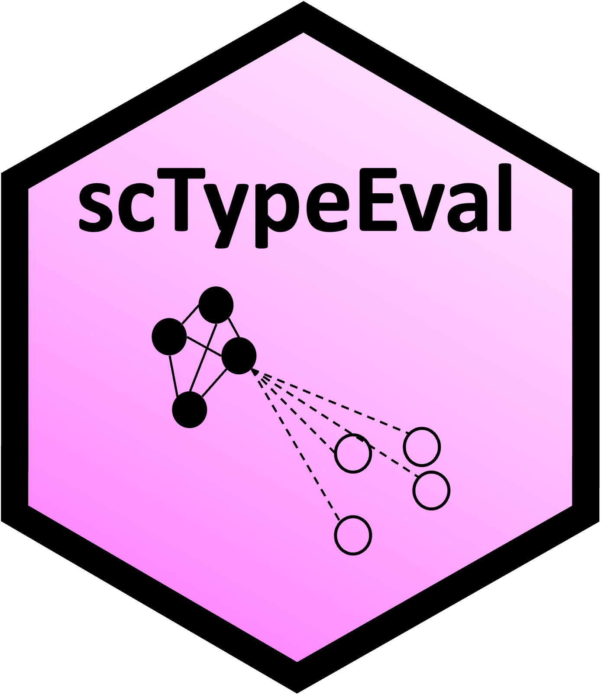

# scTypeEval :microscope: :chart_with_upwards_trend:

<p align="center">



</p>

## A Framework for Evaluating Single-Cell Transcriptomics Cell Type Annotations

`scTypeEval` is a comprehensive tool to measure the quality of cell type annotations in single-cell RNA-seq data. It provides a suite of validation metrics to benchmark annotations and improve classification performance.

Accurately evaluating cell type annotations in scRNA-seq is challenging due to the lack of actual ground truth. Traditional approaches — including manual curation and marker-based validation — are subjective, inconsistent, and often overlook subtle expression patterns. However, reliable cell type annotation should be consistent across samples and datasets, ensuring reproducibility and biological relevance.

scTypeEval addresses these challenges by using internal validation metrics to assess label consistency without requiring predefined annotations. Tested across diverse datasets and classification scenarios, it provides a robust, unbiased framework for benchmarking annotation performance.

### Key features of scTypeEval

1. **Internal validation metrics**: Assess the quality of cell type annotations without requiring ground truth labels.
2. **Benchmarking across datasets**: Evaluate annotation performance across different samples and any classification scenarios (manual annotation, automatic classifiers, or clustering).
3. **Customizable framework**: Support for user-defined different gene lists, normalization methods, and metrics parameters.
4. **Robust evaluation**: Identify misclassifications and compare classification methods using diverse metrics.

## Installation

``` r
# install.packages("remotes")
remotes::install_github("carmonalab/scTypeEval")
```


## Usage

<details>
<summary><strong>1. Create scTypeEval object</strong></summary>

`scTypeEval` objects accept either a count matrix (rows as genes and columns as cells) and its corresponding metadata, a Seurat object, or a SingleCellExperiment (SCE) object. Metadata is expected to contain annotation labels and sample identifiers, if inter-sample consistency should be leveraged.

``` r
library(scTypeEval)

# From count matrix and metadata dataframe
sceval <- create.scTypeEval(matrix = count_matrix,
                           metadata = metadata)

# From Seurat object
sceval <- create.scTypeEval(seurat_obj)

# From SCE object
sceval <- create.scTypeEval(sce)
```
</details>


<details>
<summary><strong>2. Add gene lists</strong></summary> 

Add gene list on the scTypeEval object with relevant genes to compute the consistency metrics.
`scTypeEval` supports adding highly variable genes (HVG) and cell-type-specific gene markers. Additionally, custom lists can also be added. At least one gene list must be included in the `scTypeEval` object to compute consistency metrics.

``` r
# Add HVG gene list
sceval <- add.HVG(sceval)

# Add gene markers
sceval <- add.GeneMarkers(sceval,
                         ident = "cell_type") # indicate the annotation to identify the cell types
                         
# Add a custom list (e.g. list of transcription factors, cytokines...)
sceval <- add.GeneList(sceval, gene.list = custom_list)
sceval <- add.GeneList(sceval, gene.list = list("cytokines" = c("IL10", "IL6", "IL4",...)))
```

</details>

<a name="run.consistency"></a>
<details>
<summary><strong>3. Measure internal validation metrics</strong></summary> 

Computes internal validation consistency metrics for cell type annotations. By default, the following metrics will be run: `"silhouette"`, `"NeighborhoodPurity"`, `"ward.PropMatch"`, `"Leiden.PropMatch"`, and `"modularity"`.

See [Data types inputs](#data-types-inputs) and [Consistency metrics](#consistency-metrics) for more details on the data type inputs and different consistency metrics based on internal validation metrics.

``` r
sceval <- Run.Consistency(scTypeEval = sceval,
                          ident = "cell_type", # annotation method to evaluate
                          sample = "sample_id", # if inter-sample consistency want to be captured
                          IntVal.metric = c("silhouette", "NeighborhoodPurity"), # specificy one or multiple internal validation metrics
                          data.type = "pseudobulk") # one of "sc" (single-cell), "pseudobulk" or "pseudobulk_1vsall"
```

</details>

<a name="mbh"></a>
<details>
<summary><strong>4. Measure Mutual Best Hit</strong></summary> 

This method evaluates the consistency of cell type annotations across multiple samples using a Mutual Best Hit approach. In short, it applies a classifier bidirectionally between sample pairs to assess inter-sample reciprocal similarity.

Supported options, by default both are run if possible:

* `"Mutual.Score"`: Mean of the product of reciprocal prediction scores from classifier per cell type.
* `"Mutual.Match"`: Calculates the normalized proportion of reciprocal prediction matches between samples. 

``` r
sceval <- Run.BestHit(scTypeEval = sceval, 
                      ident = "cell_type", # annotation method to evaluate
                      sample = "sample_id", # required
                      method = c("Mutual.Score", "Mutual.Match"), # Mutual Best Hit method to run
                      data.type = "pseudobulk") # one of "sc" (single-cell) or "pseudobulk"
```

</details>


<details>
<summary><strong>5. Export results</strong></summary> 

Extracts and filters consistency metrics from an `scTypeEval` object into a data frame.

``` r
results <- get.ConsistencyData(scTypeEval = sceval)
```

Example of results table:

| celltype  | measure   | consistency.metric      | distance.method | gene.list | ident  | data.type  |
|-----------|-----------|-------------------------|-----------------|-----------|--------|------------|
| Treg     | 0.3255512 | BestHit-Mutual.Match    | NA              | HVG       | annot3 | pseudobulk |
| gdT       | 0.3875000 | NeighborhoodPurity      | euclidean       | HVG       | annot3 | pseudobulk |
| Treg      | 0.4372035 | NeighborhoodPurity      | euclidean       | HVG       | annot3 | pseudobulk |
| CD16      | 0.4673913 | NeighborhoodPurity      | euclidean       | HVG       | annot3 | pseudobulk |
| CD8       | 0.4739076 | NeighborhoodPurity      | euclidean       | HVG       | annot3 | pseudobulk |
| CD8      | 0.5106117 | ward.PropMatch         | euclidean       | HVG       | annot3 | pseudobulk |
| MAIT      | 0.5962547 | NeighborhoodPurity      | euclidean       | HVG       | annot3 | pseudobulk |
| CD8      | 0.6627756 | BestHit-Mutual.Match    | NA              | HVG       | annot3 | pseudobulk |


</details>


<details>
<summary><strong>6. Wrapper</strong></summary> 

This function serves as a wrapper to compute internal validation metrics [Run.Consistency](#run.consistency) and Mutual Best Hit consistency [Run.BestHit](#mbh) evaluations for cell type annotations. It supports multiple data types in the same run.

``` r
consistency_df <- Run.scTypeEval(scTypeEval = sceval,
                                 ident = "cell_type", # annotation method to evaluate
                                 sample = "sample_id",
                                 IntVal.metric = c("silhouette", "NeighborhoodPurity"), # specificy one or multiple internal validation metrics
                                 BH.method = c("Mutual.Score", "Mutual.Match"), # Mutual Best Hit method to run
                                 data.type = "pseudobulk")
```

</details>


## Additional resources

<a name="data-types-inputs"></a>
<details>
<summary><strong>1. Data Types Inputs</strong></summary>

When computing consistency metrics, data can be structured in the following ways:

- **`sc` (Single-cell level)**: Each cell is treated as an individual observation.  
- **`pseudobulk` (Aggregated per sample & cell type)**: Expression values are summed per sample and cell type, useful for capturing inter-sample variability.  
- **`pseudobulk_1vsall` (Pairwise comparison)**: Pseudobulk for each cell type is compared against the pseudobulk of all others cell types, resulting in 2 observations per sample.

</details>


<a name="consistency-metrics"></a>
<details>
<summary><strong>2. Consistency Metrics</strong></summary>

`scTypeEval` provides a range of **internal validation metrics** to assess the quality of cell type annotations without requiring external ground truth. These metrics evaluate consistency based on different properties such as **distance**, **clustering**, and **graph structure**.

#### **Default Metrics:**
By default, the following metrics are computed:  
- **`silhouette`** – Measures how well-separated a cell type is by comparing intra-group cohesion to inter-group separation. (Distance-based)  
- **`NeighborhoodPurity`** – Assesses local consistency by checking how many of a cell's K-nearest neighbors share the same label. (Local agreement)  
- **`ward.PropMatch`** – Evaluates the proportion of dominant labels in hierarchical Ward clusters. (Clustering-based)  
- **`Leiden.PropMatch`** – Similar to Ward.PropMatch but using Leiden partition. (Clustering-based)  
- **`modularity`** – Measures how well the annotation structure aligns with graph-based community detection. (Graph structure)  

#### **All Available Metrics:**
##### **Distance-Based Metrics:**  
- **`silhouette`** – Measures how distinct each cell type is compared to others.
- **`Orbital.centroid`** – Proportion of cells/samples closer to their cluster centroid than to other clusters centroids. Evaluates tightness of each group.  
- **`Orbital.medoid`** – Proportion of cells/samples closer to their cluster medoid than to other clusters medoids. Less sensitive to outliers than centroids.  
- **`inertia`** – Sum of squared distances from points to their assigned cluster centroid.  
- **`Xie-Beni`** – Ratio of intra-cluster compactness to inter-cluster separation.  
- **`S.Dbw`** – Validates clustering based on density and separation.  
- **`I`** – Balances cluster cohesion and separation.  

##### **Clustering-Based Metrics:**  
- **`ward.PropMatch`** – Proportion of dominant labels in Ward hierarchical clusters.  
- **`ward.NMI`** – Normalized Mutual Information between Ward clusters and reference labels.  
- **`ward.ARI`** – Adjusted Rand Index for Ward clustering.  
- **`Leiden.PropMatch`** – Proportion of dominant labels in Leiden clusters.  
- **`Leiden.NMI`** – Normalized Mutual Information for Leiden partitions.  
- **`Leiden.ARI`** – Adjusted Rand Index for Leiden clustering.  

##### **Graph-Based Metrics:**  
- **`modularity`** – Strength of intra-group connectivity compared to a random model.  
- **`GraphConnectivity`** – Measures the proportion of elements within the largest connected component of a cell type.  

##### **Local Agreement Metrics:**  
- **`NeighborhoodPurity`** – Proportion of a cell's nearest neighbors sharing the same label.  

Each metric provides a unique perspective on annotation consistency, allowing for a comprehensive evaluation.  

</details>


## Citation  

The manuscript describing these methods is currently in preparation. A citation will be provided once the paper is published.  

