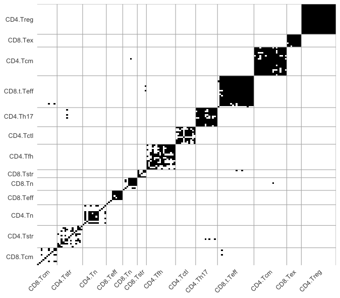

# scTypeEval :microscope: :chart_with_upwards_trend:

<p align="center">


</p>

## A Framework for Evaluating Single-Cell Transcriptomics Cell Type Annotations


Accurate cell type annotation is essential but difficult in single-cell RNA sequencing (**scRNA-seq**).  
- **Manual approaches** are time-consuming, subjective, and inconsistent.  
- **Automated classifiers** are faster but often fail to generalize across tissues, conditions, or closely related cell types.  
- A key limitation for both is the **lack of true ground truth** for benchmarking.  

**`scTypeEval`** provides a **ground-truth-agnostic framework** to systematically assess annotation quality using internal validation metrics.  
- Quantifies **inter-sample label consistency**.  
- Identifies **ambiguous or misclassified populations**.  
- Enables reproducible **benchmarking of manual annotations, automated classifiers, or clustering results**.  

### :key: Key Features  

- **Ground-truth agnostic** – Evaluate annotations without external references.  
- **Cross-dataset benchmarking** – Assess consistency across samples and studies.  
- **Customizable** – Works with Seurat, SCE, or matrices; supports custom gene lists and parameters.  
- **Robust** – Sensitive to misclassification; reliable across batch effects, label granularity, and sample sizes.  

## Installation

``` r
# install.packages("remotes")
remotes::install_github("carmonalab/scTypeEval")
```


## Usage

<details>
<summary><strong>1. Create scTypeEval object</strong></summary>

`scTypeEval` objects accept either a count matrix (rows as genes and columns as cells) and its corresponding metadata, a Seurat object, or a SingleCellExperiment (SCE) object. Metadata is expected to contain annotation labels and sample identifiers.

```r
library(scTypeEval)

# From count matrix and metadata dataframe
sceval <- create.scTypeEval(matrix = count_matrix,
                           metadata = metadata)

# From Seurat object
sceval <- create.scTypeEval(seurat_obj)

# From SCE object
sceval <- create.scTypeEval(sce)
```
</details>


<details>
<summary><strong>2. Process data </strong></summary> 

Process and normalize data stored in an `scTypeEval` object. 

This step aggregates, filters, and normalizes the count matrix, storing results as `DataAssay` objects for single-cell and pseudobulk data.  

```r
# Run data processing on an scTypeEval object
sceval <- Run.ProcessingData(
  scTypeEval = sceval,
  ident = "celltype",        # column in metadata defining identities (e.g. cell type)
  sample = "patient_id",     # column in metadata defining sample IDs
  min.samples = 5,           # minimum samples required to retain a cell type
  min.cells = 10,            # minimum cells required per sample-celltype
)
```

</details>


<details>
<summary><strong>3. Obtain relevant features</strong></summary> 

Extract relevant features such as **highly variable genes (HVGs)** and **cell type marker genes**, or add custom gene lists.
Dissimilarity and subsequently consistency will be evaluated using these features.

```r
# Identify highly variable genes (HVGs)
sceval <- Run.HVG(
  scTypeEval = sceval,
  var.method = "scran",   # method to compute HVGs
  ngenes = 2000,          # number of HVGs to retain
  sample = "patient_id"   # sample-level blocking
)

# Identify marker genes per cell type
sceval <- Run.GeneMarkers(
  scTypeEval = sceval,
  method = "scran.findMarkers", # supported: scran.findMarkers
  ngenes.celltype = 50          # max markers per cell type
)
```

Custom gene list may be also added using `add.GeneList()`.

</details>


<details>
<summary><strong>Optional: Add dimensional reduction embedding</strong></summary> 


Consistency metrics can be measured directly on relevant features selected earlier.  
However, for most methods, their computation in a **low-dimensional space** (e.g., PCA) speeds up the process while yielding very similar results.  

```r
sceval <- Run.PCA(
  scTypeEval = sceval,
  ndim = 30          # number of PCs
)
```

Alternatively, you can insert pre-computed embeddings (e.g., PCA, UMAP, t-SNE) using `add.DimReduction()`.


</details>


<details>
<summary><strong>4. Compute dissimilarity across cell type and samples</strong></summary> 

The function `Run.Dissimilarity()` computes pairwise dissimilarities between cell types across samples stored in a `scTypeEval` object.  
You can choose among several strategies depending on whether you want to compare **cell type pseudobulk profiles**, **cell type single-cell distributions**, or **classification-based matches**.  

**Available methods include:**
- **`Pseudobulk:<distance>`** – computes distances between pseudobulk gene expression profiles.  
  Supported distances: *euclidean*, *cosine*, *pearson*.  
- **`WasserStein`** – computes Wasserstein distances between distributions of cells.  
- **`BestHit:<method>`** – matches cells across groups using a classifier and computes dissimilarities.  
  Supported methods: *Match*, *Score*.  

By default, if `reduction = TRUE`, dissimilarity is computed on dimensional reduction embeddings (e.g. PCA).  
Set `reduction = FALSE` to instead compute dissimilarities on processed expression data.  


```r
# Euclidean distance based on pseudobulk aggregation
sceval <- Run.Dissimilarity(sceval,
                       method = "Pseudobulk:Euclidean",
                       reduction = FALSE) # whether to compute dissimilarities in low dimensional space

# Wasserstein distance on embeddings
sceval <- Run.Dissimilarity(sceval,
                       method = "WasserStein",
                       reduction = TRUE)

# BestHit Match using SingleR classifier
sceval <- Run.Dissimilarity(sceval,
                       method = "BestHit:Match",
                       BestHit.classifier = "SingleR")
```

<details>
<summary>Visualize dissimilarity matrix</summary>

The function `plot.Heatmap()` visualizes dissimilarity matrices stored in a scTypeEval object as annotated heatmaps.
This produces a ggplot2 heatmap with cell types grouped and optionally ordered by similarity or consistency.

```r
plot.Heatmap(sceval,
            dissimilarity.slot = "BestHit:Match",
            sort.consistency = "silhouette",
            sort.similarity = "Pseudobulk:Euclidean")
```

<p align="center">



</p>

</details>

</details>

<details>
<summary><strong>5. Compute consistency metrics</strong></summary> 

Evaluate inter-sample label consistency.

<details>
<summary>Consistency Metrics</summary>

`scTypeEval` supports a range of **internal validation metrics** to evaluate cell type annotation quality without external ground truth:

- **silhouette** – standard cohesion/separation score per cell type
- **2label.silhouette** – silhouette variant comparing "own type" vs. all others
- **NeighborhoodPurity** – fraction of K nearest neighbors sharing the same cell type
- **ward.PropMatch** – proportion of a cell type in its dominant cluster (Ward-based)
- **Orbital.medoid** – fraction of cells closer to their medoid than any other type’s medoid
- **Average.similarity** – within-cell type similarity relative to other types

Higher values indicate stronger internal consistency. Metrics can be computed per dissimilarity assay for downstream comparison across cell types, metrics, and methods.

</details>

``` r
consis <- get.Consistency(scTypeEval,
                          dissimilarity.slot = "Pseudobulk:Euclidean", # indicate in which dissimilarity space compute metrics
                          Consistency.metric = "silhouette" # choose consistency metric
                          )
```

Example of results table:

| celltype    | measure     | consistency.metric | dissimilarity_method     | ident     |
|------------|------------|------------------|------------------------|-----------|
| CD4.Tn     | -0.03104529 | silhouette       | Pseudobulk:Euclidean   | celltype  |
| CD4.Tstr   | -0.01739486 | silhouette       | Pseudobulk:Euclidean   | celltype  |
| CD4.Tfh    | 0.01741703  | silhouette       | Pseudobulk:Euclidean   | celltype  |
| CD4.Tcm    | 0.04147180  | silhouette       | Pseudobulk:Euclidean   | celltype  |
| CD8.t.Teff | 0.04487724  | silhouette       | Pseudobulk:Euclidean   | celltype  |
| CD4.Tctl   | 0.10953912  | silhouette       | Pseudobulk:Euclidean   | celltype  |
| CD8.Teff   | 0.09775360  | silhouette       | Pseudobulk:Euclidean   | celltype  |
| CD8.Tcm    | 0.10451983  | silhouette       | Pseudobulk:Euclidean   | celltype  |
| CD8.Tn     | 0.13723062  | silhouette       | Pseudobulk:Euclidean   | celltype  |
| CD8.Tstr   | 0.15740846  | silhouette       | Pseudobulk:Euclidean   | celltype  |
| CD4.Th17   | 0.24654894  | silhouette       | Pseudobulk:Euclidean   | celltype  |
| CD8.Tex    | 0.27483708  | silhouette       | Pseudobulk:Euclidean   | celltype  |
| CD4.Treg   | 0.26537602  | silhouette       | Pseudobulk:Euclidean   | celltype  |


</details>


## Citation  

The manuscript describing these methods is currently in preparation. A citation will be provided once the paper is published.  

